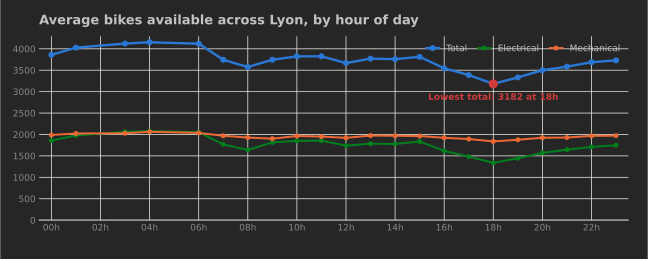

# README

<!-- LATEST:START -->
<!-- This section is updated automatically every 15 minutes by the collect workflow. -->
### 🚲 Latest update

**Latest update:** 23:51 on 13/07/2026 (Local timezone)

- Electrical bikes available: **1835**
- Mechanical bikes available: **1972**
- Total bikes available: **3821**
- Free parking stands: **5444**
- Stations open: **453/454**

**Dynamic data powered by Github Actions 🤖**
<!-- LATEST:END -->

### 📈 Availability over the last 24 hours

Total, electrical and mechanical bikes available across Lyon — the lowest point is marked in red.

## French version

Ce projet a été réalisé afin de traquer la tendance de la disponibilité des stations Velo'v à Lyon au cours de la journée.

### Fonctionnalités actuelles:

- Avoir une carte avec l'ensemble des informations suivantes:
    - Nombre de velo'v mécaniques disponibles
    - Nombre de velo'v éléctriques disponibles
    - Nombre de places disponible

### Roadmap:

- [ ] Ajouter un système de filtre/tri sur la page afin de trier les résultats.
- [ ] Ajouter une solution de stockage afin d'enregistrer les données et de les ré-utiliser par la suite.

### Capture d'écran

