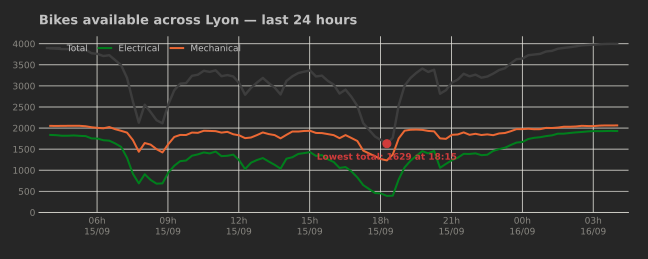
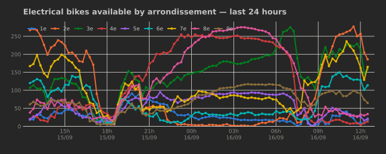

# README

<!-- LATEST:START -->
<!-- This section is updated automatically every 15 minutes by the collect workflow. -->
### 🚲 Latest update

**Latest update:** 13:00 on 16/09/2026 (Local timezone)

- Electrical bikes available: **1305**
- Mechanical bikes available: **1872**
- Total bikes available: **3180**
- Free parking stands: **5799**
- Stations open: **454/458**

**Dynamic data powered by Raspberry Pi 🍓**
<!-- LATEST:END -->

### 📈 Availability over the last 24 hours

Total, electrical and mechanical bikes available across Lyon — the lowest point is marked in red.



### 🗺️ Electrical bikes by arrondissement over the last 24 hours

Electrical Vélo'v bikes available in each of Lyon's nine arrondissements — one line per arrondissement.



## French version

Ce projet a été réalisé afin de traquer la tendance de la disponibilité des stations Velo'v à Lyon au cours de la journée.


### Fonctionnalités actuelles:

- Avoir une carte avec l'ensemble des informations suivantes:
    - Nombre de velo'v mécaniques disponibles
    - Nombre de velo'v éléctriques disponibles
    - Nombre de places disponible
    - Ajouter un système de filtre/tri sur la page afin de trier les résultats.
    - API disponible - 24h d'historique d'une station ( localhost:5000/history/<station_id> )
    - Collecte automatique des données toutes les 15 minutes sur Raspberry Pi.

### Roadmap:

- [x] Ajouter un système de filtre/tri sur la page afin de trier les résultats.
- [x] Ajouter une solution de stockage cloud (Firebase Firestore) pour enregistrer les données et l'historique.
- [x] Déploiement web en ligne (Vercel) avec graphiques interactifs (Chart.js).

### Configuration Firebase & Déploiement Vercel

#### 1. Configuration Firebase Firestore
1. Créez un projet sur la [console Firebase](https://console.firebase.google.com/).
2. Activez **Cloud Firestore**.
3. Rendez-vous dans **Paramètres du projet > Comptes de service** et générez une nouvelle clé privée (`serviceAccountKey.json`).
4. Ajoutez la clé dans votre fichier `.env` ou comme variable d'environnement :
   - Sur Raspberry Pi / local : `FIREBASE_CREDENTIALS_PATH=./serviceAccountKey.json`
   - Sur Vercel : ajoutez `FIREBASE_SERVICE_ACCOUNT` avec tout le contenu JSON de votre clé de compte de service.

#### 2. Migration des données historiques vers Firebase
Un script de migration par lots est disponible :
```bash
# Tester d'abord sans écrire dans Firebase
python3 scripts/migrate_csv_to_firebase.py --dry-run

# Migrer uniquement l'état le plus récent (très rapide)
python3 scripts/migrate_csv_to_firebase.py --latest-only

# Migrer l'ensemble des données (~500 000 entrées) par lots
python3 scripts/migrate_csv_to_firebase.py
```

#### 3. Déploiement sur Vercel
1. Importez ce dépôt Git sur [Vercel](https://vercel.com).
2. Dans **Environment Variables**, ajoutez :
   - `JCD_API_KEY` : votre clé d'API JCDecaux
   - `FIREBASE_SERVICE_ACCOUNT` : le contenu JSON de votre compte de service Firebase
3. Déployez ! L'application est configurée via `vercel.json` et `api/index.py`.

### Capture d'écran


